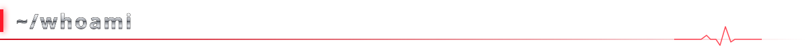
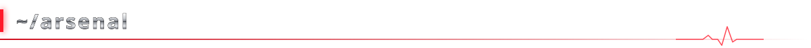
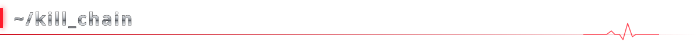
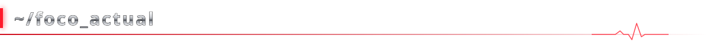
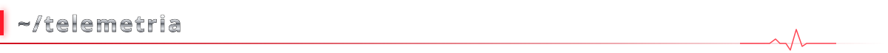
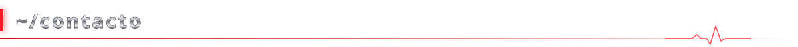

<div align="center">



<br>


</div>

<br>





<br>



<div align="center">

**Active Directory**<br>


<br>

**Reconocimiento, web y pivoting**<br>


<br>

**Scripting y plataformas**<br>


</div>

<br>



| Táctica (MITRE ATT&CK) | Lo que practico |
| :--- | :--- |
| Reconocimiento | OSINT en entornos AD, enumeración de OWA |
| Acceso inicial | Phishing, password spraying, credenciales expuestas |
| Evasión de defensas | Bypass de AMSI y CLM, técnica manual antes que herramienta |
| Persistencia | Tareas programadas, claves Run, servicios, Golden Tickets |
| Escalada de privilegios | Abuso de DACL, Shadow Credentials, noPac |
| Acceso a credenciales | Kerberoasting (incluido el dirigido), NTLM relay |
| Movimiento lateral | Pass-the-Ticket, WinRM, pivoting |
| Lado azul | Consultas KQL y mitigaciones para cada técnica |

<br>



```text
[~] CRTO ................ preparación en curso  (Zero-Point Security)
[~] RastaLabs (HTB) ..... preparación en curso
[~] Notas de estudio AD . publicándose en GitHub
```

```
<div align="center">

<a href="https://github.com/Sh1kata-Ga-Nai/Sh1kata-Ga-Nai">

</a>

</div>
```

<br>



<div align="center">


</div>

<br>



<div align="center">

<a href="https://www.linkedin.com/in/TU_USUARIO"></a>
<a href="https://app.hackthebox.com/users/TU_ID"></a>
<a href="mailto:TU_CORREO"></a>

</div>

<br>


<div align="center">

<sub>Todo lo publicado aquí es para laboratorios y entornos con autorización explícita.</sub>

</div>
